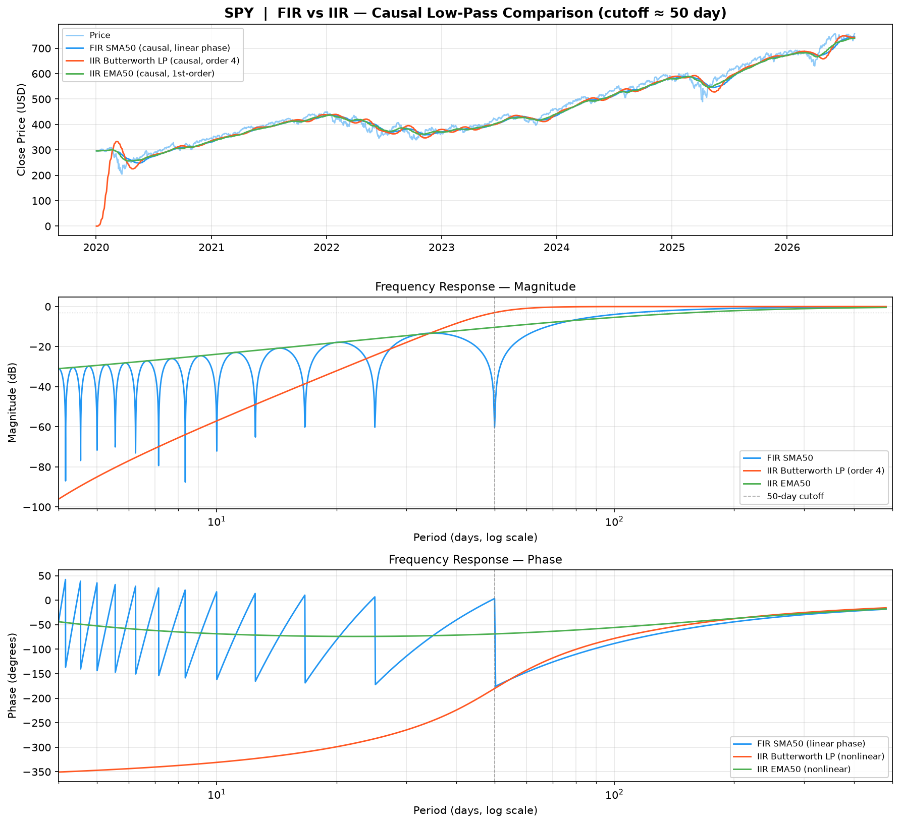
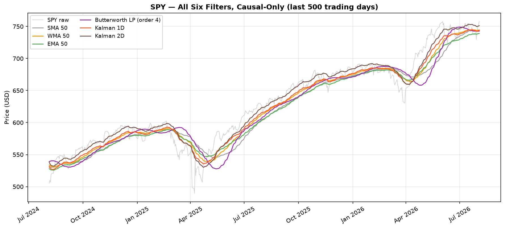
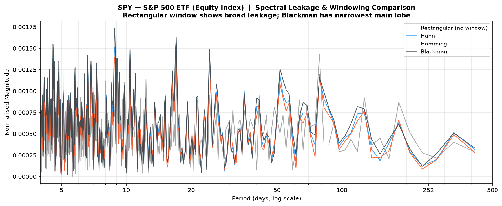
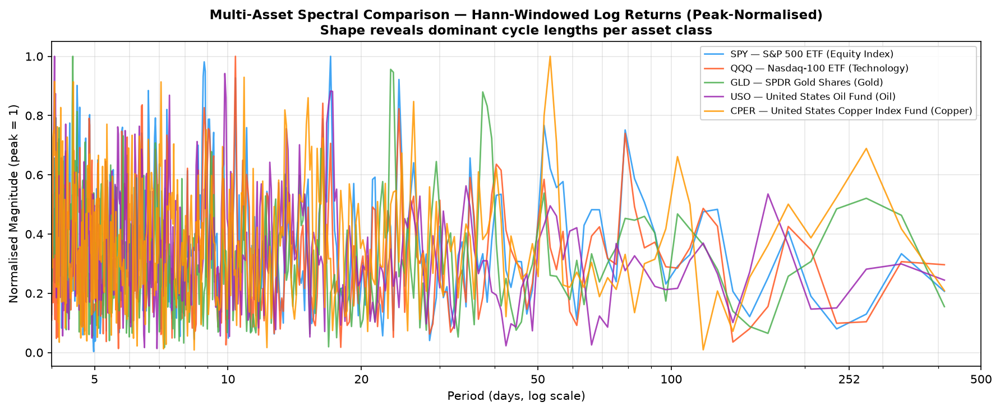
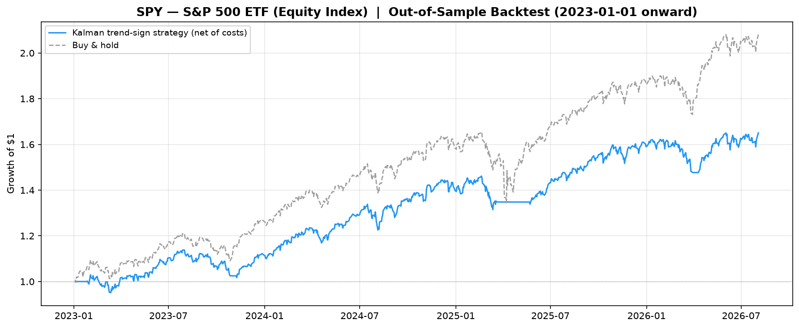
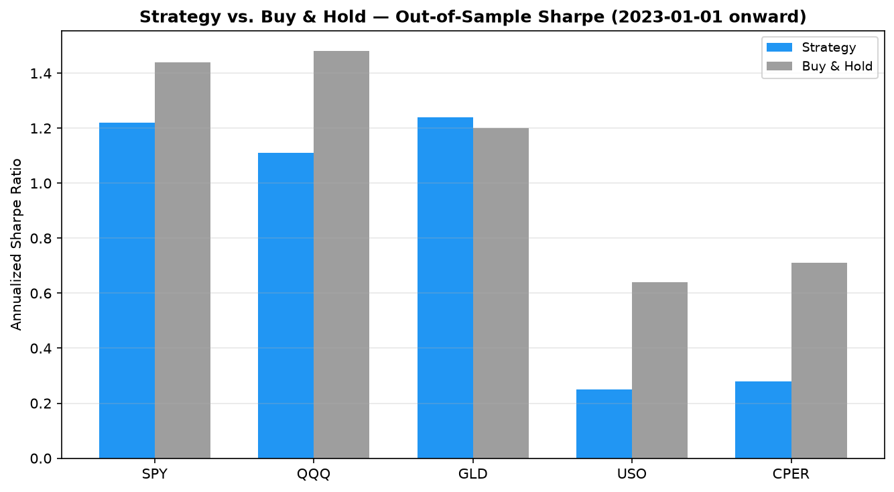

# Financial Signal Processing Platform

Applies classical and adaptive digital signal processing — FIR/IIR filter design,
FFT spectral analysis, and a from-scratch Kalman filter — to five years of daily
OHLCV data across five asset classes, in order to separate trend from noise and
characterize the cyclical structure hiding in price data.

Built as a bridge project between electrical engineering coursework (signals &
systems, DSP) and quantitative finance: every technique here is standard DSP
theory, applied to a domain — market data — where the "signal" is famously mostly
noise. That mismatch is treated explicitly throughout rather than glossed over
(see [Limitations](#limitations--honest-caveats)).

## Why this exists

I'm an EE undergrad, and I wanted a portfolio project that could credibly go on
both an EE application (real filter design, frequency response, adaptive
estimation) and a quant application (applied to real market data, with the
usual quant instinct to ask "does this actually tell you anything"). Rather than
build two separate toy projects, this applies one DSP toolchain to one dataset
and is explicit about what each technique can and can't claim about price data.

## Pipeline

```
download_data.py  →  data/*.csv  →  plot_data.py        → figures/  (raw price overview)
                                  →  compute_metrics.py  → figures/  (MAs, returns, volatility)
                                  →  filters.py           → figures/  (FIR vs IIR filter design)
                                  →  fft_analysis.py       → figures/  (spectral analysis)
                                  →  kalman_filter.py      → notebooks/ (from-scratch Kalman)
                                  →  metrics.py            → quantitative filter comparison
                                  →  backtest.py           → figures/  (out-of-sample signal check)
```

Each stage only reads the CSVs `download_data.py` produces — no stage re-fetches
or mutates another stage's output, so any script can be re-run independently.

| File | Role |
|---|---|
| [`common.py`](common.py) | Shared asset universe, CSV loader, and plot-axis helper used by every script below — no other file redefines these. |
| [`download_data.py`](download_data.py) | Pulls 2020–present daily OHLCV for SPY, QQQ, GLD, USO, CPER from Yahoo Finance; validates monotonic dates and missing-data rate. |
| [`plot_data.py`](plot_data.py) | Normalized cross-asset performance and per-asset price panels. |
| [`compute_metrics.py`](compute_metrics.py) | Moving averages, daily returns, 30-day rolling annualized volatility. |
| [`filters.py`](filters.py) | FIR (SMA, WMA, `firwin` bandpass) and IIR (EMA, Butterworth LP/HP/BP) filters, plus magnitude/phase frequency response via `freqz`. |
| [`fft_analysis.py`](fft_analysis.py) | FFT validated on a synthetic two-tone signal first, then applied to log returns; windowing/spectral-leakage comparison; multi-asset spectral comparison. |
| [`kalman_filter.py`](kalman_filter.py) | `KalmanFilter1D` (price as a random walk) and `KalmanFilter2D` (price + local trend/velocity), written from the predict/update equations directly — no `pykalman`/`filterpy`. |
| [`metrics.py`](metrics.py) | RMSE, MAE, noise reduction (dB), tracking error, and cross-correlation-based lag — pure functions used to compare every filter above on equal footing. |
| [`backtest.py`](backtest.py) | Turns the Kalman 2D trend sign into a long/flat rule and evaluates it strictly out-of-sample (Q/R fit on 2020–2022 only, performance measured 2023-01-01 onward), net of a flat transaction cost. |
| [`notebooks/`](notebooks/) | `kalman_synthetic_test`, `kalman_market_analysis`, `filter_comparison` — Q/R sensitivity, 1D vs 2D Kalman, and a head-to-head of all six filters. |

## Key findings

All numbers below are computed directly from the code in this repo against the
included SPY data (2020-01-02 → 2026-08-03, 1,654 trading days) — nothing here
is hand-picked or illustrative.

### 1. FIR vs. IIR: six filters, one fair comparison

`filter_comparison.ipynb`'s methodology, reproduced here: run all six filters
**causally** (no `filtfilt`, so lag is real) with a common ~50-day span, then
score each against a 300-day zero-phase Butterworth low-pass used as a proxy
for the underlying trend.

| Filter | RMSE | MAE | Noise Reduction (dB) | Tracking Error |
|---|---:|---:|---:|---:|
| Raw price (unfiltered) | 18.10 | 12.83 | 16.77 | 18.04 |
| SMA 50 | 15.00 | 11.97 | 18.91 | 13.83 |
| WMA 50 | 14.54 | 10.65 | 18.73 | 14.11 |
| **EMA 50** | **14.08** | 11.58 | **19.50** | **13.17** |
| Butterworth LP (order 4, causal) | 34.04 | 16.74 | 11.48 | 33.14 |
| Kalman 1D | 14.47 | **10.56** | 18.78 | 14.31 |
| Kalman 2D (price + trend) | 16.73 | 11.61 | 17.44 | 16.70 |

EMA50 and Kalman 1D are essentially tied for best tracking on this window — expected,
since a steady-state Kalman 1D with fixed (Q, R) converges to an exponential
weighting scheme functionally close to an EMA (the "Kalman gain over time" figure
below shows this convergence directly, K → 0.068 steady-state, comparable to
EMA50's α = 2/51 ≈ 0.039).

The **causal Butterworth is the standout counter-example**: it looks excellent
in the zero-phase (`filtfilt`) figures because those are acausal — they filter
forward and backward and cancel phase distortion using the *entire* series,
including future data. Run causally with the same coefficients, its all-pole
recursion has to "ring up" from a zero initial condition, producing a large
transient at the start of the series that inflates every error metric. This is
the single clearest illustration in the project of why zero-phase filtering
is a visualization/offline-analysis tool, not something you can deploy causally
without accounting for filter warm-up — a real IIR design consideration, not
a market-data quirk.




### 2. Lag: theory over measurement

`metrics.py` includes a cross-correlation-based lag estimator. Two things worth
being upfront about, because both are more interesting than a clean number:

- **It had a bug.** The correlation direction was flipped, so it silently
  reported ~0 lag for every filter regardless of true delay. Fixed in
  [`metrics.py`](metrics.py) (one-line sign fix in `filter_lag`, verified against
  a synthetic signal with known lag).
- **Even fixed, it's the wrong tool for raw price levels.** Price is so
  autocorrelated (SPY: 0.994 correlation at a 10-day lag, 0.972 at 50 days) that
  the cross-correlation peak is nearly flat — the estimator can't reliably find
  the true lag on a near-unit-root series. It needs a stationary input (returns,
  or a detrended series) to be meaningful; documented as a limitation in the
  docstring rather than silently producing numbers that look precise but aren't.

The lag that *is* solid here is the closed-form theoretical value: SMA-M is a
symmetric FIR filter, so its group delay is exactly (M−1)/2 samples; EMA's
effective lag is (1−α)/α. Both evaluate to **24.5 days** at M = 50 — matching
the visible offset between price and MA in the plots above, and matching each
other, which is exactly what filter theory predicts for two ~50-day smoothers.

### 3. Spectral leakage is visible, not just asserted

Four window functions (rectangular, Hann, Hamming, Blackman) on the same SPY
return series — the rectangular window's spectral "skirts" around every peak are
the textbook picture of leakage, and each subsequent window trades main-lobe
width for leakage suppression exactly as DSP theory predicts.



### 4. Different assets, different dominant cycles

Multi-asset FFT on Hann-windowed log returns (top spectral peaks, 4–500 day range):

| Asset | Dominant periods (days) |
|---|---|
| SPY (equity index) | ~17, ~9 |
| QQQ (tech) | ~10, ~16, ~6 |
| GLD (gold) | ~4, ~23, ~24 |
| USO (oil) | ~4, ~10, ~17 |
| CPER (copper) | **~53**, ~11, ~4 |

Copper stands out with a much longer dominant cycle (~53 days) than the other
four assets, which cluster in the 4–24 day range — consistent with copper's
reputation as a slower-moving, industrial-demand-driven macro signal rather
than a short-horizon, sentiment-driven one.



### 5. Volatility snapshot (30-day rolling, annualized, as of latest data)

| Asset | Current | Historical avg |
|---|---:|---:|
| SPY | 13.3% | 17.3% |
| QQQ | 25.3% | 22.6% |
| GLD | 22.1% | 17.0% |
| USO | 59.9% | 37.5% |
| CPER | 24.6% | 25.4% |

USO is running at ~1.6x its historical average volatility; SPY is currently
below its historical average — both consistent with oil's structurally higher
vol-of-vol relative to a broad equity index.

### 6. Does the trend signal actually carry information? An honest out-of-sample check

Every prior section characterizes filtered signals; it doesn't say whether they're
worth anything. [`backtest.py`](backtest.py) closes that loop as narrowly and
honestly as possible: `KalmanFilter2D`'s Q/R are fit on 2020–2022 data only, the
filter then runs causally and continuously across the full series (as a live
system would — nothing resets at the test boundary), and a simple long/flat rule
(hold the asset when yesterday's trend estimate was positive, else hold cash, 5 bps
cost per position change) is scored **only** on 2023-01-01 onward — data the
parameter fit never saw.

| Asset | Strategy Sharpe | Buy&Hold Sharpe | Strategy CAGR | Buy&Hold CAGR | Strategy MaxDD | Buy&Hold MaxDD | Trades |
|---|---:|---:|---:|---:|---:|---:|---:|
| SPY | 1.22 | 1.44 | 15.1% | 22.9% | -10.7% | -18.8% | 7 |
| QQQ | 1.11 | 1.48 | 19.3% | 32.2% | -14.0% | -22.8% | 5 |
| GLD | 1.24 | 1.20 | 24.1% | 24.4% | -21.2% | -26.4% | 5 |
| USO | 0.25 | 0.64 | 3.2% | 18.1% | -40.7% | -32.5% | 11 |
| CPER | 0.28 | 0.71 | 3.8% | 16.8% | -31.9% | -24.8% | 10 |

**Read the losses, not just the wins** — this is the actual result, not a cherry-picked one:

- On four of five assets the strategy underperforms plain buy-and-hold on both
  Sharpe and CAGR. That's the expected cost of a long/flat rule during a
  persistent bull run (2023–2026 across every asset here): going to cash even a
  handful of times means missing some of the best up days, and 5–11 trades over
  ~3.6 years means the filter mostly just sat long anyway.
- Where it's genuinely doing something is **drawdown, on the trending assets**:
  SPY, QQQ, and GLD all see materially smaller max drawdowns under the strategy
  (e.g. SPY -10.7% vs. -18.8%) — a real, if modest, risk-reduction property, not
  a return-enhancement one.
- That property **breaks down on the choppier commodity assets**: USO and CPER
  end up with *worse* Sharpe *and* worse drawdown than buy-and-hold. The most
  likely explanation is that a 2-state constant-velocity Kalman model is a poor
  fit for oil/copper's noisier, less trend-persistent dynamics — but with only
  5 assets and one train/test split, that's a hypothesis worth testing further,
  not a conclusion.

None of this is presented as a trading strategy. It's one train/test split, one
hyperparameter choice, no walk-forward re-fitting, and a flat cost assumption —
enough to honestly answer "does this signal contain any information," not enough
to fund anything on. Overclaiming here would undercut every other honest number
in this README.




## Installation & usage

```bash
pip install -r requirements.txt
python download_data.py       # fetch data/*.csv (Yahoo Finance)
python plot_data.py           # figures/normalized_prices.png, individual_prices.png
python compute_metrics.py     # prompts for a ticker → figures/{TICKER}_metrics.png
python filters.py             # prompts for a ticker → FIR/IIR figures
python fft_analysis.py        # prompts for a ticker → FFT/windowing figures
python kalman_filter.py       # runs built-in sanity checks against synthetic data
python backtest.py            # out-of-sample backtest → figures/backtest_*.png
```

`compute_metrics.py`, `filters.py`, and `fft_analysis.py` prompt interactively
for a ticker (1–5 or symbol). The Kalman filter is explored in
[`notebooks/`](notebooks/) rather than as a standalone script — start with
`kalman_synthetic_test.ipynb`.

## Limitations & honest caveats

- **Mostly in-sample, with one deliberate exception.** Filter parameters
  elsewhere in the project (M = 50, Butterworth order 4) are fixed and not
  selected via any out-of-sample procedure — those sections are signal
  decomposition, not a predictive claim. `backtest.py` is the one place that
  evaluates out-of-sample (see [finding #6](#6-does-the-trend-signal-actually-carry-information-an-honest-out-of-sample-check)),
  but on a single train/test split with a single hyperparameter choice — not
  enough rigor to call it a validated strategy, just enough to answer whether
  the signal contains information at all.
- **No causal/acausal mixing in the headline figures.** The FIR/IIR overview
  figures use `filtfilt` (zero-phase) for visual clarity; the "6 filters" and
  "FIR vs IIR" figures switch to causal-only implementations specifically to
  keep lag comparisons honest. This is called out explicitly in each figure's
  title.
- **FFT assumes stationarity that financial returns don't really have**
  (volatility clustering, regime changes). The spectral peaks above describe
  average frequency content over the full 2020–2026 window, not time-localized
  structure — a spectrogram/wavelet decomposition would be a natural next step.
- **Lag estimation caveat** — see [Key finding #2](#2-lag-theory-over-measurement)
  above.

## Requirements

Python 3.10+, see [`requirements.txt`](requirements.txt) (yfinance, pandas,
numpy, scipy, matplotlib).

## License

[MIT](LICENSE)
